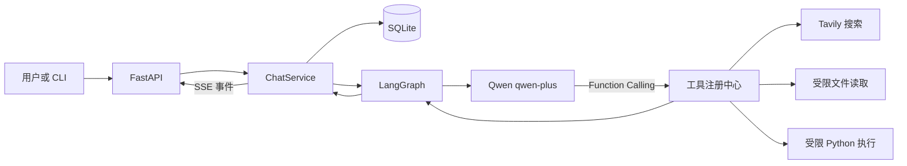

# ToolUse-Agent-Lab

一个基于 LangGraph 的 Tool-Use Agent 实验项目。系统使用阿里云百炼
`qwen-plus` 完成推理与 Function Calling，支持 Tavily 网页搜索、受限本地
文件读取、受限 Python 执行、SQLite 多轮会话持久化，以及 FastAPI SSE
事件流。

本项目不包含 RAG、向量数据库或文档检索链路。

## 功能

- LangGraph 显式推理节点、工具节点与最大工具步数保护
- Qwen OpenAI 兼容接口，默认模型 `qwen-plus`
- Tavily 实时网页搜索
- 仅允许读取 `workspace/` 内文本文件
- AST 检查、临时目录、超时与输出限制的 Python 子进程执行
- SQLite 会话、消息、工具审计和结构化历史摘要
- FastAPI 普通响应与 SSE 流式事件
- 通过 HTTP 使用服务的终端聊天客户端
- 无付费 API 调用的本地测试，以及显式启用的真实 API 冒烟测试

## 架构



核心代码位于 `src/tool_use_agent/`：

- `agent/`：状态、提示词和 LangGraph 工具循环
- `tools/`：统一工具契约、注册中心与三个工具
- `memory/`：SQLite 数据模型与仓库
- `llm/`：Qwen 客户端和历史摘要器
- `api/`：请求模型、REST 端点和 SSE 编码
- `service.py`：多轮会话、审计和历史压缩编排
- `composition.py`：真实运行依赖装配
- `cli.py`：HTTP/SSE 终端客户端

## 环境准备

项目面向 conda 环境 `agent`，Python 版本为 3.12。

```powershell
conda activate agent
python -m pip install -e . --no-build-isolation
```

设置 API Key：

```powershell
$env:DASHSCOPE_API_KEY="你的百炼 API Key"
$env:TAVILY_API_KEY="你的 Tavily API Key"
```

程序通过以下方式读取密钥，不会从源码读取或保存真实值：

```python
os.getenv("DASHSCOPE_API_KEY")
os.getenv("TAVILY_API_KEY")
```

其他配置可参考 `.env.example`。默认数据库为 `agent.db`，默认文件工作目录
为 `workspace/`。

## 启动服务

```powershell
conda activate agent
uvicorn tool_use_agent.composition:create_application --factory --host 127.0.0.1 --port 8000
```

健康检查：

```powershell
curl.exe http://127.0.0.1:8000/health
```

## 使用 CLI

另开一个终端：

```powershell
conda activate agent
tool-agent --base-url http://127.0.0.1:8000
```

CLI 会显示会话 ID、工具开始/完成/失败事件和最终回答。恢复已有会话：

```powershell
tool-agent --base-url http://127.0.0.1:8000 --session-id <SESSION_ID>
```

## API

| 方法 | 路径 | 说明 |
| --- | --- | --- |
| `GET` | `/health` | 健康检查 |
| `POST` | `/v1/sessions` | 创建会话 |
| `GET` | `/v1/sessions/{id}` | 查询会话 |
| `GET` | `/v1/sessions/{id}/messages` | 查询消息历史 |
| `POST` | `/v1/chat` | 返回完整回答 |
| `POST` | `/v1/chat/stream` | 返回 SSE 事件流 |

创建会话并聊天：

```powershell
$session = Invoke-RestMethod -Method Post -Uri http://127.0.0.1:8000/v1/sessions
$body = @{
  session_id = $session.id
  message = "搜索 LangGraph 官方文档并给出来源链接"
} | ConvertTo-Json
Invoke-RestMethod -Method Post -Uri http://127.0.0.1:8000/v1/chat `
  -ContentType "application/json" -Body $body
```

SSE 事件包括：`message_start`、`tool_start`、`tool_result`、`tool_error`、
`message_end` 和 `error`。每个事件包含会话 ID 与请求 ID，工具事件还包含
工具调用 ID。

## 测试

本地测试不会访问真实付费 API：

```powershell
python -m pytest -m "not live" -q
python -m compileall -q src tests
```

确认两个 API Key 均已设置后，可显式运行真实冒烟测试：

```powershell
python -m pytest tests/live/test_live_smoke.py -m live -q -s
```

真实测试会产生 Qwen 与 Tavily API 用量。

## 安全边界

`read_file` 拒绝绝对路径、路径穿越、符号链接越界、二进制文件和超大文件。

`python_exec` 使用 AST 黑白名单、Python `-I` 模式、独立临时目录、最小环境、
硬超时和输出截断。这些措施适合本地演示和半可信输入，但它不是生产级安全
沙箱，不能安全执行恶意代码。处理不可信代码时应改用容器或虚拟机隔离。

API Key、SQLite 文件、运行时工作目录、内部设计文档和本地 Git worktree 均由
`.gitignore` 排除。

## 演示流程

1. 启动 FastAPI 服务和 CLI。
2. 在 `workspace/notes.txt` 写入一段文本。
3. 输入：`读取 notes.txt，总结内容，然后用 Python 统计字符数。`
4. 观察文件工具、Python 工具和最终回答事件。
5. 输入：`搜索 LangGraph 官方文档，并给出来源 URL。`
6. 重启服务后使用原会话 ID，验证 SQLite 会话可以恢复。

该流程对应项目中的复合任务、工具路由、SSE、错误处理和多轮持久化能力。
